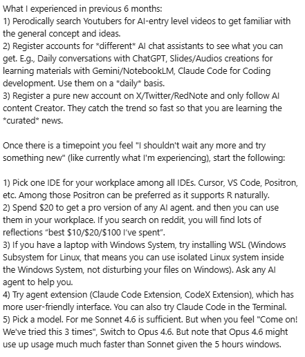
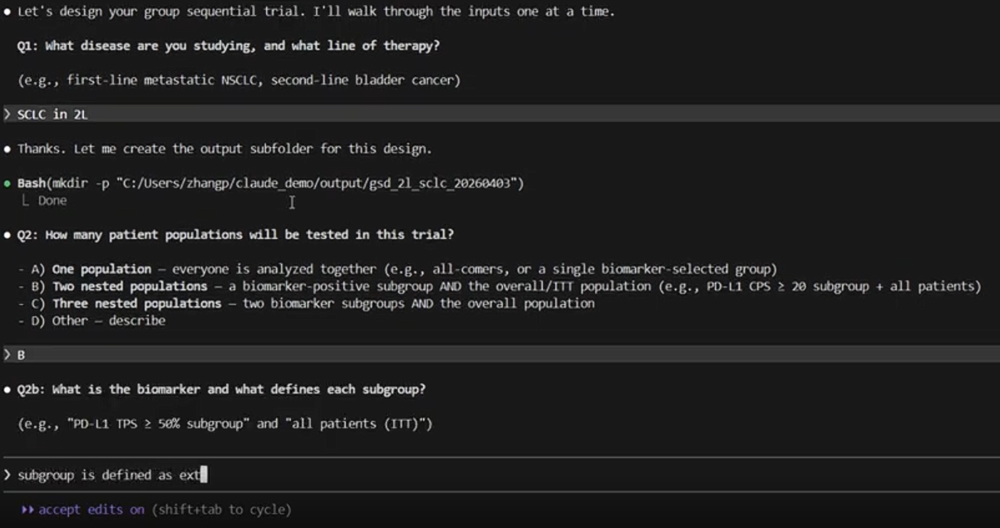
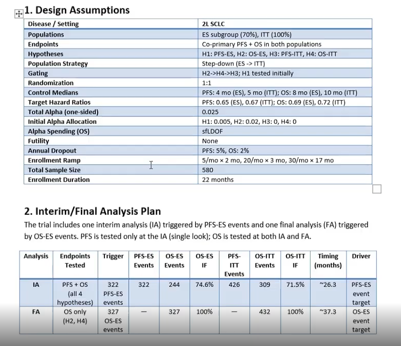
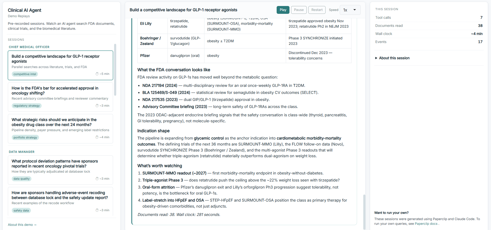
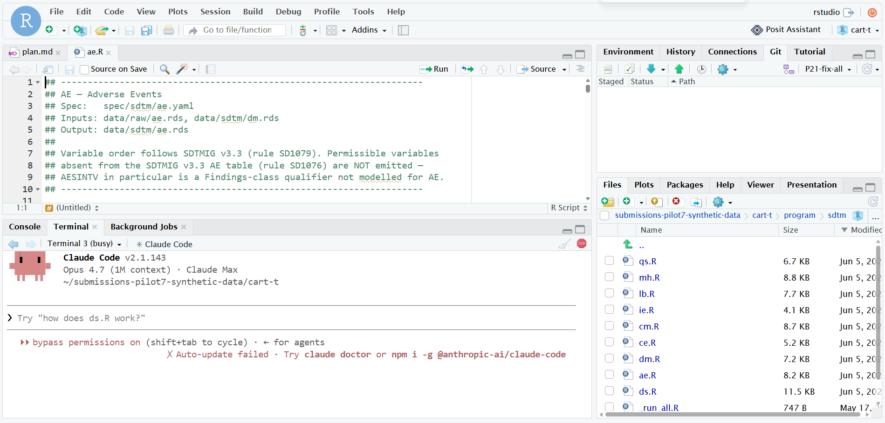

## {.bigtext}

This talk is presented in two different time zones:

- **US session** — Peng Zhang
  - Associate Director, Innovative Data Sciences
- **APAC session** — Mia Chen
  - Clinical Data Scientist

## Where I'm coming from

::: {.columns}
::: {.column width="55%"}
From a LinkedIn post I wrote — **six months of getting my hands dirty** before any of the workflow work:

- **Daily** practice with different AI assistants
- Follow **AI creators**; learn the *curated* news
- Then pick an **IDE**, spend **$20** on a pro agent, and work **inside the IDE**
- The whole point: *get your hands dirty first.*

[Read the post on LinkedIn](https://www.linkedin.com/posts/peng-zhang-4522a0127_finally-i-have-configured-claude-code-on-activity-7433203325115719680-gj3U){style="text-decoration: underline;"}
:::
::: {.column width="45%"}
{fig-alt="LinkedIn post describing a six-month AI exploration roadmap" width="520px" fig-align="center"}
:::
:::

# Before — early exploration

## Where I started

::: {.incremental}
- AI began as a **personal productivity experiment** — not a strategy.
- Then **Eric Zhang** asked me to review slides for **PharmaDS 2026** and a talk on **Pharma Skills**.
- Seeing them, it clicked: **LLMs are now accessible to anyone** — not just specialists.
:::

. . .

[PharmaDS 2026 short courses](https://phds.nestat.org/short_courses.html){.smaller} · [Pharma Skills video](https://drive.google.com/file/d/1O9-SCJEoXGJv6J3YXuZ1eiVB4Jk6Gao/view){.smaller}

## What I saw

An LLM designing a **group sequential trial** end to end:

::: {.columns}
::: {.column width="50%"}
{fig-alt="Claude Code conversational session designing a group sequential trial" height="300px" fig-align="center"}

*Conversational design — it asks for inputs one at a time.*
:::
::: {.column width="50%"}
{fig-alt="Generated design assumptions and interim/final analysis plan tables" height="300px" fig-align="center"}

*The generated design assumptions and analysis plan.*
:::
:::

## Suddenly affordable

::: {.incremental}
- Anyone can run **Claude Code** or **Codex** right in the **terminal** on their PC — just a **$20** subscription.
- **No need to build orchestration** — use it directly.
- **Numerous resources** to connect (e.g., **ClinicalTrials.gov**).
- **Hands-on**: build a workflow and try something yourself.
:::

# During — observations after diving in

## Building a workflow is easy now

::: {.incremental}
- The **"Skill"** concept in Claude.
- Instruct it with a **markdown file** and references.
- The **context window** is large enough to absorb all the knowledge you provide.
:::

## Example — a "Clinical AI Agent"

A **paperclip-style** demo built in **R Shiny**, with pre-recorded results:

{fig-alt="Clinical AI Agent Shiny app showing a GLP-1 receptor agonist competitive landscape" width="66%" fig-align="center"}

[pzhang-link-claude-code-paperclip.share.connect.posit.cloud](https://pzhang-link-claude-code-paperclip.share.connect.posit.cloud/){.smaller}

## Example — generating a mock shell

{fig-alt="Animation of Claude Code generating a mock shell" width="72%" fig-align="center"}

## Agentic workflow — performance

::: {.incremental}
- We'll see many agentic workflows claim to produce **code/results in hours**.
- For **common deliverables (e.g., TFL)**, a workflow can match a standard team — comparably or even **faster**.
- But ask: **what are we comparing against?**
- It's a good way to use AI to **accelerate an existing, validated process** — one built and maintained over years.
:::

## Agentic workflow — evaluation

::: {.incremental}
- A **Pharma Skills** working group.
- Build a **benchmark** with test cases — *easy, medium, difficult*.
- Define **rubrics** — Compliance, Correctness, Completeness.
- Run the **evaluation**.
- **Collect the evidence** and results.
:::

## Efficiency — data models matter

::: {.incremental}
- The **data models** that sit between your input and your output.
- An inspiring thread of conversations with **Doug Kelkhoff**.
- In the era of agents and LLMs, **data models may matter even more** — structured data that connects to unstructured context.
- The payoff: **reliability and efficiency**.
:::

## Sometimes the agent is better than me

::: {.incremental}
- After all this, I started to think the agent is sometimes **better — and more careful — than I am**.
- More and more documents get written **for the agent** (e.g., **CLAUDE.md**) to make it efficient.
- Fortunately, in our industry **humans stay accountable** for every asset.
- So I keep asking: what is the **minimum a human must still do**?
- And **what should stay human-readable**?
:::

## Human-in-the-loop — a real test

::: {.incremental}
- "Keep a human in the loop" **sounds like a safety guarantee.**
- A real experience: working on **Pilot 7** ([R Consortium synthetic-data submission](https://github.com/RConsortium/submissions-pilot7-synthetic-data)).
- **Yilong** asked: *can you generate SDTM and ADaM data from a source dataset in `.xml`?*
- **Why not?**
:::

## How I did it {.smaller}

::: {.columns}
::: {.column width="58%"}
- Built a **Docker** image for **RStudio**
- Installed **Claude Code** inside it — through RStudio's **terminal**
- Then had Claude Code:
  - read **90K+ lines** of source data; build an **HTML visualization**
  - **split by domain** to get a feel for the data
  - reference the **SDTM IG** via an index (saves context)
  - write the **SDTM spec** as **.yaml** (human + machine readable)
  - write **R code** from the .yaml; generate datasets + check logs
  - resolve all coding errors — then do the same for **ADaM**
:::
::: {.column width="42%"}
{fig-alt="RStudio with Claude Code running in the terminal on the pilot7 project" height="240px" fig-align="center"}

See the output in **[Pull Request #5](https://github.com/RConsortium/submissions-pilot7-synthetic-data/pull/5)**.

Including environment setup, this took **~5 hours** total for the initial draft.
:::
:::

## But — am I really in the loop?

::: {.incremental}
- One uncomfortable truth: after generating the data, **I know almost nothing about it.**
- I can't be sure the **code** is right or the **data** is right.
- I only know: the **spec is written**, **code generated**, **no errors**, **data produced** — and **I'm a human in the loop.**
- Is *that* what "**human-in-the-loop**" should mean? **What are we missing?**
- The missing piece: an **immediate human review / approve / authorize** step to ensure correctness.
- **Still ongoing.**
:::

## Governance is the hard part

In a regulated environment, capability is the easy half. The other half:

::: {.incremental}
- **Data privacy** — HIPAA, GDPR
- **Confidential information & trade secrets** — what can leave the building?
- **Where does the model run?** — trust in **Anthropic vs Azure vs Amazon Bedrock**
:::

## Things I'm still chewing on

- A **Claude Code course** — getting the team to the same baseline
- Documents authored **for agents**, not just humans
- How to make "human review" **mean something** under real time pressure

# Conclusion

## What I'd leave you with

::: {.incremental}
1. **Get your hands dirty first** — the ceiling moves faster than the slides about it.
2. Building a workflow is **easy now**; making it **reliable and governed** is the real work.
3. The new bottleneck is **human understanding and review**, not cost or compute.
4. **Evaluate** with benchmarks and rubrics; lean on solid **data models**.
5. **Accountability stays with people** — design for that, don't pretend otherwise.
:::

. . .

Thank you — questions welcome.
